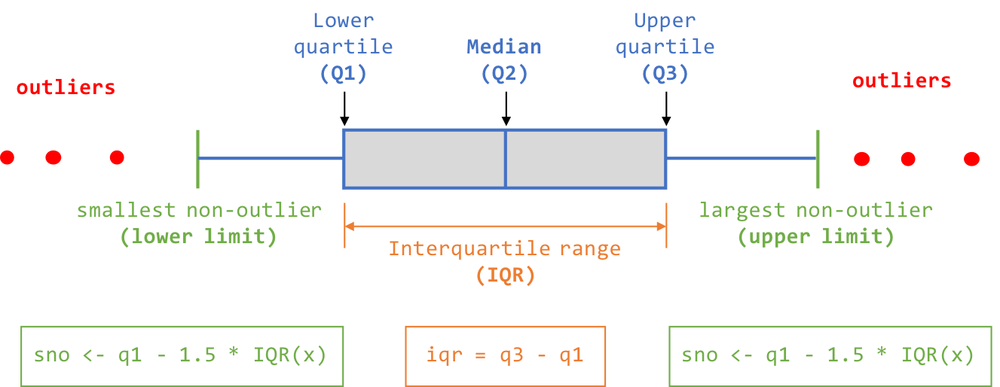

# Introdução

##Sobre o estudo - *WINE QUALITY*
Há dois datasets neste estudo, um sobre vinho tinto e outro sobre vinho branco.

## Cojunto de Dados:

1. Vinho Tinto (*winequality-red.csv*) com w = 1599 observações.
2. Vinho Branco (*winequality-white.csv*) com w = 4898 observações.

**TOTAL DE OBSERVAÇÕES W = 6497 observações.**

Os dois conjuntos de dados estão relacionados a variantes de vinhos tinto e vinhos brancos portugueses. Devido a problemas de privacidade e outras questões, apenas as variáveis fisicoquímicas (entradas) e sensoriais (de saída) estão disponíveis. Neste sentido, não há dados sobre os tipos de uvas, marca de vinho, preço de venda de vinho, etc.)

## Atributos

Ambos os data sets possuem os mesmos **12 atributos**:

01. fixed.acidity        = Acidez fixa
02. volatile.acidity     = Acidez volátil
03. citric.acid          = Ácido cítrico
04. residual.sugar       = Açucar residual
05. chlorides            = Cloretos
06. free.sulfur.dioxide  = Livre de dióxido de enxofre
07. total.sulfur.dioxide = Total de dióxido de enxofre
08. density              = Densidade
09. pH                   = pH             
10. sulphates            = Sulfatos
11. alcohol              = Teor alcólico
12. quality              = Qualidade

Esses conjuntos de dados podem ser vistos para atividades de classificação ou regressão. As clases são encomendadas e não equilibradas (por exemplo, existem mais vinhos normais do que excelentes ou pobres). Os algoritmos de detecção de Outlier podem ser usados para detectar alguns vinhos excelentes ou pobres. Além disso, não temos certeza se todas as variáveis de entrada são relevantes. Portanto, pode ser interessante testar métodos de seleção de recursos.

## Fonte dos dados 
Os dados foram baixados do site: [UCI - Machine Learning Repository](https://archive.ics.uci.edu/ml/datasets/wine+quality) 

## Para mais informações  
Cortez et al., 2009 [Modeling wine preferences by data mining from physicochemical properties](http://www.sciencedirect.com/science/article/pii/S0167923609001377?via%3Dihub)

# 2. Tratamento dos dados: estudo e remoção de outliers



## Setup: Definição de "caminhos"

Difinição do caminho padrão, para utilizar este código no seu computador, mude a string *wine.path* para a pasta onde você descarregou os arquivos do projeto. O local onde estarão os dados e demais códigos do *R* se ajustarão automaticamente.
```{r, message=FALSE, warning=FALSE}
# ******************************************************************************
# #### SETUP ####
# ******************************************************************************
## work directory path ##
wine.path = "/Users/fernandoperes/dev/r/r-wine/" # to be reused as needed
setwd(wine.path) 
## Sources
source(file =  paste(wine.path, "wines-0-utils.R", sep = ""))
## Libraries
library(dplyr)
library(ggplot2)

getwd()

# ******************************************************************************
# #### Load prepared data files ####
# ******************************************************************************
load(file="all-wine.Rda") # load(file="red-wine.Rda") # load(file="white-wine.Rda")
```

<!-- 
********************************************************************************
********************************************************************************
1. Acidez fixa - análise de outliers
********************************************************************************
********************************************************************************
-->
## Atributo 1: Acidez fixa - análise de outliers

### Inicialização 
Variáveis temporárias para ajudar a fazer cópia do código para outros atributos, bastando apenas mudá-las os cálculos se ajustarão ao atributo corrente. Objetivo: evitar retrabalho.

```{r, warning=FALSE}
#### Inicialização para facilitar cada bloco
## initialization (decrease rework) 
x = all.wine$fixed.acidity
field.label = wine.fields.fixed.acidity
field.name  = "fixed.acidity"
```
<b><u>Observações "wines-utils.R":</u></b>
<ul>
  <li><b>wine.fields.fixed.acidity</b> é uma constante definida em "wines-utils.R"</li>
</ul>

### Calcular os limites (inferior e superior, excluindo outliers)

<b><u>Nota:</u></b>
<ul>
  <li>iqr = q3 - q1</li>
  <li>sno <- q1 - 1.5 * IQR(x) # sno = smallest non-outlier</li>
  <li>lno <- q3 + 1.5 * IQR(x) # lno = largest non-outlie</li>
</ul>
```{r}
### calculo dos limites inferiores e superiores do atributo
sno.lno = wine.sno.lno(x)
sno.lno
```
<b><u>Observações "wines-utils.R":</u></b>
<ul>
  <li><b>wine.sno.lno()</b> é uma função que calcula os limites inferior e superior de uma variável numérica. No final do documento será disponibilizado o código fonte da função, especialmente desenvolvido para esse projeto = "Wine".</li>
</ul>

### Marcar as linhas que são outliers

Marcar as linhas que são outliers de acordo com os limites calculados anteriormente

<b><u>Observações "wines-utils.R":</u></b>
<ul>
  <li><b>wine.mark.outlier()</b> é uma função que marca os outliers baseado nos limites inferior e superior calculados de uma variável numérica. No final do documento será disponibilizado o código fonte da função, especialmente desenvolvido para esse projeto = "Wine".</li>
</ul>
```{r}
# mark ouliers
all.wine$outlier <- wine.mark.outlier(start = TRUE, df = all.wine, 
                                      field = field.name, sno.lno = sno.lno)
table(all.wine$outlier) # after marked outliers
```
Nota: <b>TRUE = outlier</b>


### Criação de um sub conjunto, sem outliers 

```{r, message=FALSE, warning=FALSE}
# Get the subset of ALL.WINE excluding marked outliers
all.wine.non.outliers <- all.wine %>% filter(all.wine$outlier == FALSE)
x2 <- all.wine.non.outliers$fixed.acidity
```

### Resultados

#### Antes de marcar os outliers

<b><u>Observações "wines-utils.R":</u></b>
<ul>
  <li><b>wine.distribution.plot()</b> é uma função que plota dois gráficos de distribuição de uma variável numérica. No final do documento será disponibilizado o código fonte da função, especialmente desenvolvido para esse projeto = "Wine".</li>
</ul>

```{r}
# Plot field distribution with ALL (including outliers) 
par.customized <- par(mfrow = c(1, 2))
title = paste(field.label, " - com outliers presentes", sep = "")
wine.distribution.plot(title = title, x = x, field.label = field.label,
                       color =  wine.color.all, xlim = c(min(x), max(x)), 
                       sno.lno = sno.lno, line.color = "red")
```

#### Após marcar os outliers
<b><u>Observações "wines-utils.R":</u></b>
<ul>
  <li><b>wine.distribution.plot()</b> é uma função que plota dois gráficos de distribuição de uma variável numérica. No final do documento será disponibilizado o código fonte da função, especialmente desenvolvido para esse projeto = "Wine".</li>
</ul>

```{r}
# Plot field distribution excluding outliers) 
par.customized <- par(mfrow = c(1, 2))
title = paste(field.label, " - com outliers removidos", sep = "")
wine.distribution.plot(title = title, x = x2, field.label = field.label, 
                       color =  wine.color.all, xlim = c(min(x), max(x)), 
                       sno.lno = sno.lno, line.color = "red" )
```

#### Relatório de outliers
<b><u>Observações "wines-utils.R":</u></b>
<ul>
  <li><b>wine.outliers.summary.plot()</b> é uma função que plota dois com os resultados sobre a quantidade de outliers. No final do documento será disponibilizado o código fonte da função, especialmente desenvolvido para esse projeto = "Wine".</li>
</ul>
```{r}
## plot the difference all X witout outliers
par.customized <- par(mfrow = c(1, 2))
title = paste(field.label, " - status de outliers", sep = "")
wine.outliers.summary.plot(title = title, t = table(all.wine$outlier), 
                           colors = c("green", "dark red"))

table(all.wine$outlier)
```
Nota: <b>TRUE = outlier</b>

<!-- 
********************************************************************************
********************************************************************************
 2. Acidez volátil - análise de outliers
********************************************************************************
********************************************************************************
-->

## Atributo 2: Acidez volátil - análise de outliers

### Inicialização 
Variáveis temporárias para ajudar a fazer cópia do código para outros atributos, bastando apenas mudá-las os cálculos se ajustarão ao atributo corrente. Objetivo: evitar retrabalho.

```{r, warning=FALSE}
#### Inicialização para facilitar cada bloco
## initialization (decrease rework) 
x = all.wine$volatile.acidity
field.label = wine.fields.volatile.acidity
field.name  = "volatile.acidity"
```
<b><u>Observações "wines-utils.R":</u></b>
<ul>
  <li><b>wine.fields.fixed.acidity</b> é uma constante definida em "wines-utils.R"</li>
</ul>

### Calcular os limites (inferior e superior, excluindo outliers)

<b><u>Nota:</u></b>
<ul>
  <li>iqr = q3 - q1</li>
  <li>sno <- q1 - 1.5 * IQR(x) # sno = smallest non-outlier</li>
  <li>lno <- q3 + 1.5 * IQR(x) # lno = largest non-outlie</li>
</ul>
```{r}
### calculo dos limites inferiores e superiores do atributo
sno.lno = wine.sno.lno(x)
sno.lno
```
<b><u>Observações "wines-utils.R":</u></b>
<ul>
  <li><b>wine.sno.lno()</b> é uma função que calcula os limites inferior e superior de uma variável numérica. No final do documento será disponibilizado o código fonte da função, especialmente desenvolvido para esse projeto = "Wine".</li>
</ul>

### Marcar as linhas que são outliers

Marcar as linhas que são outliers de acordo com os limites calculados anteriormente

<b><u>Observações "wines-utils.R":</u></b>
<ul>
  <li><b>wine.mark.outlier()</b> é uma função que marca os outliers baseado nos limites inferior e superior calculados de uma variável numérica. No final do documento será disponibilizado o código fonte da função, especialmente desenvolvido para esse projeto = "Wine".</li>
</ul>
```{r}
# mark ouliers
all.wine$outlier <- wine.mark.outlier(start = TRUE, df = all.wine, 
                                      field = field.name, sno.lno = sno.lno)
table(all.wine$outlier) # after marked outliers
```
Nota: <b>TRUE = outlier</b>


### Criação de um sub conjunto, sem outliers 

```{r, message=FALSE, warning=FALSE}
# Get the subset of ALL.WINE excluding marked outliers
all.wine.non.outliers <- all.wine %>% filter(all.wine$outlier == FALSE)
x2 <- all.wine.non.outliers$volatile.acidity
```

### Resultados

#### Antes de marcar os outliers

<b><u>Observações "wines-utils.R":</u></b>
<ul>
  <li><b>wine.distribution.plot()</b> é uma função que plota dois gráficos de distribuição de uma variável numérica. No final do documento será disponibilizado o código fonte da função, especialmente desenvolvido para esse projeto = "Wine".</li>
</ul>

```{r}
# Plot field distribution with ALL (including outliers) 
par.customized <- par(mfrow = c(1, 2))
title = paste(field.label, " - com outliers presentes", sep = "")
wine.distribution.plot(title = title, x = x, field.label = field.label,
                       color =  wine.color.all, xlim = c(min(x), max(x)), 
                       sno.lno = sno.lno, line.color = "red")
```

#### Após marcar os outliers
<b><u>Observações "wines-utils.R":</u></b>
<ul>
  <li><b>wine.distribution.plot()</b> é uma função que plota dois gráficos de distribuição de uma variável numérica. No final do documento será disponibilizado o código fonte da função, especialmente desenvolvido para esse projeto = "Wine".</li>
</ul>

```{r}
# Plot field distribution excluding outliers) 
par.customized <- par(mfrow = c(1, 2))
title = paste(field.label, " - com outliers removidos", sep = "")
wine.distribution.plot(title = title, x = x2, field.label = field.label, 
                       color =  wine.color.all, xlim = c(min(x), max(x)), 
                       sno.lno = sno.lno, line.color = "red" )
```

#### Relatório de outliers
<b><u>Observações "wines-utils.R":</u></b>
<ul>
  <li><b>wine.outliers.summary.plot()</b> é uma função que plota dois com os resultados sobre a quantidade de outliers. No final do documento será disponibilizado o código fonte da função, especialmente desenvolvido para esse projeto = "Wine".</li>
</ul>
```{r}
## plot the difference all X witout outliers
par.customized <- par(mfrow = c(1, 2))
title = paste(field.label, " - status de outliers", sep = "")
wine.outliers.summary.plot(title = title, t = table(all.wine$outlier), 
                           colors = c("green", "dark red"))

table(all.wine$outlier)
```
Nota: <b>TRUE = outlier</b>

<!-- 
********************************************************************************
********************************************************************************
 3. Ácido cítrico - análise de outliers
********************************************************************************
********************************************************************************
-->

## Atributo 3: Ácido cítrico - análise de outliers

### Inicialização 
Variáveis temporárias para ajudar a fazer cópia do código para outros atributos, bastando apenas mudá-las os cálculos se ajustarão ao atributo corrente. Objetivo: evitar retrabalho.

```{r, warning=FALSE}
#### Inicialização para facilitar cada bloco
## initialization (decrease rework) 
x = all.wine$citric.acid
field.label = wine.fields.citric.acid
field.name  = "citric.acid"
```
<b><u>Observações "wines-utils.R":</u></b>
<ul>
  <li><b>wine.fields.fixed.acidity</b> é uma constante definida em "wines-utils.R"</li>
</ul>

### Calcular os limites (inferior e superior, excluindo outliers)

<b><u>Nota:</u></b>
<ul>
  <li>iqr = q3 - q1</li>
  <li>sno <- q1 - 1.5 * IQR(x) # sno = smallest non-outlier</li>
  <li>lno <- q3 + 1.5 * IQR(x) # lno = largest non-outlie</li>
</ul>
```{r}
### calculo dos limites inferiores e superiores do atributo
sno.lno = wine.sno.lno(x)
sno.lno
```
<b><u>Observações "wines-utils.R":</u></b>
<ul>
  <li><b>wine.sno.lno()</b> é uma função que calcula os limites inferior e superior de uma variável numérica. No final do documento será disponibilizado o código fonte da função, especialmente desenvolvido para esse projeto = "Wine".</li>
</ul>

### Marcar as linhas que são outliers

Marcar as linhas que são outliers de acordo com os limites calculados anteriormente

<b><u>Observações "wines-utils.R":</u></b>
<ul>
  <li><b>wine.mark.outlier()</b> é uma função que marca os outliers baseado nos limites inferior e superior calculados de uma variável numérica. No final do documento será disponibilizado o código fonte da função, especialmente desenvolvido para esse projeto = "Wine".</li>
</ul>
```{r}
# mark ouliers
all.wine$outlier <- wine.mark.outlier(start = TRUE, df = all.wine, 
                                      field = field.name, sno.lno = sno.lno)
table(all.wine$outlier) # after marked outliers
```
Nota: <b>TRUE = outlier</b>


### Criação de um sub conjunto, sem outliers 

```{r, message=FALSE, warning=FALSE}
# Get the subset of ALL.WINE excluding marked outliers
all.wine.non.outliers <- all.wine %>% filter(all.wine$outlier == FALSE)
x2 <- all.wine.non.outliers$citric.acid
```

### Resultados

#### Antes de marcar os outliers

<b><u>Observações "wines-utils.R":</u></b>
<ul>
  <li><b>wine.distribution.plot()</b> é uma função que plota dois gráficos de distribuição de uma variável numérica. No final do documento será disponibilizado o código fonte da função, especialmente desenvolvido para esse projeto = "Wine".</li>
</ul>

```{r}
# Plot field distribution with ALL (including outliers) 
par.customized <- par(mfrow = c(1, 2))
title = paste(field.label, " - com outliers presentes", sep = "")
wine.distribution.plot(title = title, x = x, field.label = field.label,
                       color =  wine.color.all, xlim = c(min(x), max(x)), 
                       sno.lno = sno.lno, line.color = "red")
```

#### Após marcar os outliers
<b><u>Observações "wines-utils.R":</u></b>
<ul>
  <li><b>wine.distribution.plot()</b> é uma função que plota dois gráficos de distribuição de uma variável numérica. No final do documento será disponibilizado o código fonte da função, especialmente desenvolvido para esse projeto = "Wine".</li>
</ul>

```{r}
# Plot field distribution excluding outliers) 
par.customized <- par(mfrow = c(1, 2))
title = paste(field.label, " - com outliers removidos", sep = "")
wine.distribution.plot(title = title, x = x2, field.label = field.label, 
                       color =  wine.color.all, xlim = c(min(x), max(x)), 
                       sno.lno = sno.lno, line.color = "red" )
```

#### Relatório de outliers
<b><u>Observações "wines-utils.R":</u></b>
<ul>
  <li><b>wine.outliers.summary.plot()</b> é uma função que plota dois com os resultados sobre a quantidade de outliers. No final do documento será disponibilizado o código fonte da função, especialmente desenvolvido para esse projeto = "Wine".</li>
</ul>
```{r}
## plot the difference all X witout outliers
par.customized <- par(mfrow = c(1, 2))
title = paste(field.label, " - status de outliers", sep = "")
wine.outliers.summary.plot(title = title, t = table(all.wine$outlier), 
                           colors = c("green", "dark red"))

table(all.wine$outlier)
```
Nota: <b>TRUE = outlier</b>

### <u>Observação:</u> atributo com a maior quantidade de ouliers.

<!-- 
********************************************************************************
********************************************************************************
 4. Acucar residual- análise de outliers
********************************************************************************
********************************************************************************
-->

## Atributo 4: Açucar resisual - análise de outliers

### Inicialização 
Variáveis temporárias para ajudar a fazer cópia do código para outros atributos, bastando apenas mudá-las os cálculos se ajustarão ao atributo corrente. Objetivo: evitar retrabalho.

```{r, warning=FALSE}
#### Inicialização para facilitar cada bloco
## initialization (decrease rework) 
x = all.wine$residual.sugar
field.label = wine.fields.residual.sugar
field.name  = "residual.sugar"
```
<b><u>Observações "wines-utils.R":</u></b>
<ul>
  <li><b>wine.fields.fixed.acidity</b> é uma constante definida em "wines-utils.R"</li>
</ul>

### Calcular os limites (inferior e superior, excluindo outliers)

<b><u>Nota:</u></b>
<ul>
  <li>iqr = q3 - q1</li>
  <li>sno <- q1 - 1.5 * IQR(x) # sno = smallest non-outlier</li>
  <li>lno <- q3 + 1.5 * IQR(x) # lno = largest non-outlie</li>
</ul>
```{r}
### calculo dos limites inferiores e superiores do atributo
sno.lno = wine.sno.lno(x)
sno.lno
```
<b><u>Observações "wines-utils.R":</u></b>
<ul>
  <li><b>wine.sno.lno()</b> é uma função que calcula os limites inferior e superior de uma variável numérica. No final do documento será disponibilizado o código fonte da função, especialmente desenvolvido para esse projeto = "Wine".</li>
</ul>

### Marcar as linhas que são outliers

Marcar as linhas que são outliers de acordo com os limites calculados anteriormente

<b><u>Observações "wines-utils.R":</u></b>
<ul>
  <li><b>wine.mark.outlier()</b> é uma função que marca os outliers baseado nos limites inferior e superior calculados de uma variável numérica. No final do documento será disponibilizado o código fonte da função, especialmente desenvolvido para esse projeto = "Wine".</li>
</ul>
```{r}
# mark ouliers
all.wine$outlier <- wine.mark.outlier(start = TRUE, df = all.wine, 
                                      field = field.name, sno.lno = sno.lno)
table(all.wine$outlier) # after marked outliers
```
Nota: <b>TRUE = outlier</b>


### Criação de um sub conjunto, sem outliers 

```{r, message=FALSE, warning=FALSE}
# Get the subset of ALL.WINE excluding marked outliers
all.wine.non.outliers <- all.wine %>% filter(all.wine$outlier == FALSE)
x2 <- all.wine.non.outliers$residual.sugar
```

### Resultados

#### Antes de marcar os outliers

<b><u>Observações "wines-utils.R":</u></b>
<ul>
  <li><b>wine.distribution.plot()</b> é uma função que plota dois gráficos de distribuição de uma variável numérica. No final do documento será disponibilizado o código fonte da função, especialmente desenvolvido para esse projeto = "Wine".</li>
</ul>

```{r}
# Plot field distribution with ALL (including outliers) 
par.customized <- par(mfrow = c(1, 2))
title = paste(field.label, " - com outliers presentes", sep = "")
wine.distribution.plot(title = title, x = x, field.label = field.label,
                       color =  wine.color.all, xlim = c(min(x), max(x)), 
                       sno.lno = sno.lno, line.color = "red")
```

#### Após marcar os outliers
<b><u>Observações "wines-utils.R":</u></b>
<ul>
  <li><b>wine.distribution.plot()</b> é uma função que plota dois gráficos de distribuição de uma variável numérica. No final do documento será disponibilizado o código fonte da função, especialmente desenvolvido para esse projeto = "Wine".</li>
</ul>

```{r}
# Plot field distribution excluding outliers) 
par.customized <- par(mfrow = c(1, 2))
title = paste(field.label, " - com outliers removidos", sep = "")
wine.distribution.plot(title = title, x = x2, field.label = field.label, 
                       color =  wine.color.all, xlim = c(min(x), max(x)), 
                       sno.lno = sno.lno, line.color = "red" )
```

#### Relatório de outliers
<b><u>Observações "wines-utils.R":</u></b>
<ul>
  <li><b>wine.outliers.summary.plot()</b> é uma função que plota dois com os resultados sobre a quantidade de outliers. No final do documento será disponibilizado o código fonte da função, especialmente desenvolvido para esse projeto = "Wine".</li>
</ul>
```{r}
## plot the difference all X witout outliers
par.customized <- par(mfrow = c(1, 2))
title = paste(field.label, " - status de outliers", sep = "")
wine.outliers.summary.plot(title = title, t = table(all.wine$outlier), 
                           colors = c("green", "dark red"))

table(all.wine$outlier)
```
Nota: <b>TRUE = outlier</b>

<!-- 
********************************************************************************
********************************************************************************
5. Cloretos - análise de outliers
********************************************************************************
********************************************************************************
-->
## Atributo 5: Cloretos - análise de outliers

### Inicialização 
Variáveis temporárias para ajudar a fazer cópia do código para outros atributos, bastando apenas mudá-las os cálculos se ajustarão ao atributo corrente. Objetivo: evitar retrabalho.

```{r, warning=FALSE}
#### Inicialização para facilitar cada bloco
## initialization (decrease rework) 
x = all.wine$chlorides
field.label = wine.fields.chlorides
field.name  = "chlorides"
```
<b><u>Observações "wines-utils.R":</u></b>
<ul>
  <li><b>wine.fields.fixed.acidity</b> é uma constante definida em "wines-utils.R"</li>
</ul>

### Calcular os limites (inferior e superior, excluindo outliers)

<b><u>Nota:</u></b>
<ul>
  <li>iqr = q3 - q1</li>
  <li>sno <- q1 - 1.5 * IQR(x) # sno = smallest non-outlier</li>
  <li>lno <- q3 + 1.5 * IQR(x) # lno = largest non-outlie</li>
</ul>
```{r}
### calculo dos limites inferiores e superiores do atributo
sno.lno = wine.sno.lno(x)
sno.lno
```
<b><u>Observações "wines-utils.R":</u></b>
<ul>
  <li><b>wine.sno.lno()</b> é uma função que calcula os limites inferior e superior de uma variável numérica. No final do documento será disponibilizado o código fonte da função, especialmente desenvolvido para esse projeto = "Wine".</li>
</ul>

### Marcar as linhas que são outliers

Marcar as linhas que são outliers de acordo com os limites calculados anteriormente

<b><u>Observações "wines-utils.R":</u></b>
<ul>
  <li><b>wine.mark.outlier()</b> é uma função que marca os outliers baseado nos limites inferior e superior calculados de uma variável numérica. No final do documento será disponibilizado o código fonte da função, especialmente desenvolvido para esse projeto = "Wine".</li>
</ul>
```{r}
# mark ouliers
all.wine$outlier <- wine.mark.outlier(start = TRUE, df = all.wine, 
                                      field = field.name, sno.lno = sno.lno)
table(all.wine$outlier) # after marked outliers
```
Nota: <b>TRUE = outlier</b>


### Criação de um sub conjunto, sem outliers 

```{r, message=FALSE, warning=FALSE}
# Get the subset of ALL.WINE excluding marked outliers
all.wine.non.outliers <- all.wine %>% filter(all.wine$outlier == FALSE)
x2 <- all.wine.non.outliers$chlorides
```

### Resultados

#### Antes de marcar os outliers

<b><u>Observações "wines-utils.R":</u></b>
<ul>
  <li><b>wine.distribution.plot()</b> é uma função que plota dois gráficos de distribuição de uma variável numérica. No final do documento será disponibilizado o código fonte da função, especialmente desenvolvido para esse projeto = "Wine".</li>
</ul>

```{r}
# Plot field distribution with ALL (including outliers) 
par.customized <- par(mfrow = c(1, 2))
title = paste(field.label, " - com outliers presentes", sep = "")
wine.distribution.plot(title = title, x = x, field.label = field.label,
                       color =  wine.color.all, xlim = c(min(x), max(x)), 
                       sno.lno = sno.lno, line.color = "red")
```

#### Após marcar os outliers
<b><u>Observações "wines-utils.R":</u></b>
<ul>
  <li><b>wine.distribution.plot()</b> é uma função que plota dois gráficos de distribuição de uma variável numérica. No final do documento será disponibilizado o código fonte da função, especialmente desenvolvido para esse projeto = "Wine".</li>
</ul>

```{r}
# Plot field distribution excluding outliers) 
par.customized <- par(mfrow = c(1, 2))
title = paste(field.label, " - com outliers removidos", sep = "")
wine.distribution.plot(title = title, x = x2, field.label = field.label, 
                       color =  wine.color.all, xlim = c(min(x), max(x)), 
                       sno.lno = sno.lno, line.color = "red" )
```

#### Relatório de outliers
<b><u>Observações "wines-utils.R":</u></b>
<ul>
  <li><b>wine.outliers.summary.plot()</b> é uma função que plota dois com os resultados sobre a quantidade de outliers. No final do documento será disponibilizado o código fonte da função, especialmente desenvolvido para esse projeto = "Wine".</li>
</ul>
```{r}
## plot the difference all X witout outliers
par.customized <- par(mfrow = c(1, 2))
title = paste(field.label, " - status de outliers", sep = "")
wine.outliers.summary.plot(title = title, t = table(all.wine$outlier), 
                           colors = c("green", "dark red"))

table(all.wine$outlier)
```
Nota: <b>TRUE = outlier</b>

<!-- 
********************************************************************************
********************************************************************************
6. Livre de dioxido de enxofre - análise de outliers
********************************************************************************
********************************************************************************
-->
## Atributo 6: Livre de dioxido de enxofre - análise de outliers

### Inicialização 
Variáveis temporárias para ajudar a fazer cópia do código para outros atributos, bastando apenas mudá-las os cálculos se ajustarão ao atributo corrente. Objetivo: evitar retrabalho.

```{r, warning=FALSE}
#### Inicialização para facilitar cada bloco
## initialization (decrease rework) 
x = all.wine$free.sulfur.dioxide
field.label = wine.fields.free.sulfur.dioxide
field.name  = "free.sulfur.dioxide"
```
<b><u>Observações "wines-utils.R":</u></b>
<ul>
  <li><b>wine.fields.fixed.acidity</b> é uma constante definida em "wines-utils.R"</li>
</ul>

### Calcular os limites (inferior e superior, excluindo outliers)

<b><u>Nota:</u></b>
<ul>
  <li>iqr = q3 - q1</li>
  <li>sno <- q1 - 1.5 * IQR(x) # sno = smallest non-outlier</li>
  <li>lno <- q3 + 1.5 * IQR(x) # lno = largest non-outlie</li>
</ul>
```{r}
### calculo dos limites inferiores e superiores do atributo
sno.lno = wine.sno.lno(x)
sno.lno
```
<b><u>Observações "wines-utils.R":</u></b>
<ul>
  <li><b>wine.sno.lno()</b> é uma função que calcula os limites inferior e superior de uma variável numérica. No final do documento será disponibilizado o código fonte da função, especialmente desenvolvido para esse projeto = "Wine".</li>
</ul>

### Marcar as linhas que são outliers

Marcar as linhas que são outliers de acordo com os limites calculados anteriormente

<b><u>Observações "wines-utils.R":</u></b>
<ul>
  <li><b>wine.mark.outlier()</b> é uma função que marca os outliers baseado nos limites inferior e superior calculados de uma variável numérica. No final do documento será disponibilizado o código fonte da função, especialmente desenvolvido para esse projeto = "Wine".</li>
</ul>
```{r}
# mark ouliers
all.wine$outlier <- wine.mark.outlier(start = TRUE, df = all.wine, 
                                      field = field.name, sno.lno = sno.lno)
table(all.wine$outlier) # after marked outliers
```
Nota: <b>TRUE = outlier</b>


### Criação de um sub conjunto, sem outliers 

```{r, message=FALSE, warning=FALSE}
# Get the subset of ALL.WINE excluding marked outliers
all.wine.non.outliers <- all.wine %>% filter(all.wine$outlier == FALSE)
x2 <- all.wine.non.outliers$free.sulfur.dioxide
```

### Resultados

#### Antes de marcar os outliers

<b><u>Observações "wines-utils.R":</u></b>
<ul>
  <li><b>wine.distribution.plot()</b> é uma função que plota dois gráficos de distribuição de uma variável numérica. No final do documento será disponibilizado o código fonte da função, especialmente desenvolvido para esse projeto = "Wine".</li>
</ul>

```{r}
# Plot field distribution with ALL (including outliers) 
par.customized <- par(mfrow = c(1, 2))
title = paste(field.label, " - com outliers presentes", sep = "")
wine.distribution.plot(title = title, x = x, field.label = field.label,
                       color =  wine.color.all, xlim = c(min(x), max(x)), 
                       sno.lno = sno.lno, line.color = "red")
```

#### Após marcar os outliers
<b><u>Observações "wines-utils.R":</u></b>
<ul>
  <li><b>wine.distribution.plot()</b> é uma função que plota dois gráficos de distribuição de uma variável numérica. No final do documento será disponibilizado o código fonte da função, especialmente desenvolvido para esse projeto = "Wine".</li>
</ul>

```{r}
# Plot field distribution excluding outliers) 
par.customized <- par(mfrow = c(1, 2))
title = paste(field.label, " - com outliers removidos", sep = "")
wine.distribution.plot(title = title, x = x2, field.label = field.label, 
                       color =  wine.color.all, xlim = c(min(x), max(x)), 
                       sno.lno = sno.lno, line.color = "red" )
```

#### Relatório de outliers
<b><u>Observações "wines-utils.R":</u></b>
<ul>
  <li><b>wine.outliers.summary.plot()</b> é uma função que plota dois com os resultados sobre a quantidade de outliers. No final do documento será disponibilizado o código fonte da função, especialmente desenvolvido para esse projeto = "Wine".</li>
</ul>
```{r}
## plot the difference all X witout outliers
par.customized <- par(mfrow = c(1, 2))
title = paste(field.label, " - status de outliers", sep = "")
wine.outliers.summary.plot(title = title, t = table(all.wine$outlier), 
                           colors = c("green", "dark red"))

table(all.wine$outlier)
```
Nota: <b>TRUE = outlier</b>

<!-- 
********************************************************************************
********************************************************************************
7. Total de dioxido de enxofre - análise de outliers
********************************************************************************
********************************************************************************
-->
## Atributo 7: Total de dioxido de enxofre - análise de outliers

### Inicialização 
Variáveis temporárias para ajudar a fazer cópia do código para outros atributos, bastando apenas mudá-las os cálculos se ajustarão ao atributo corrente. Objetivo: evitar retrabalho.

```{r, warning=FALSE}
#### Inicialização para facilitar cada bloco
## initialization (decrease rework) 
x = all.wine$total.sulfur.dioxide
field.label = wine.fields.total.sulfur.dioxide
field.name  = "total.sulfur.dioxide"
```
<b><u>Observações "wines-utils.R":</u></b>
<ul>
  <li><b>wine.fields.fixed.acidity</b> é uma constante definida em "wines-utils.R"</li>
</ul>

### Calcular os limites (inferior e superior, excluindo outliers)

<b><u>Nota:</u></b>
<ul>
  <li>iqr = q3 - q1</li>
  <li>sno <- q1 - 1.5 * IQR(x) # sno = smallest non-outlier</li>
  <li>lno <- q3 + 1.5 * IQR(x) # lno = largest non-outlie</li>
</ul>
```{r}
### calculo dos limites inferiores e superiores do atributo
sno.lno = wine.sno.lno(x)
sno.lno
```
<b><u>Observações "wines-utils.R":</u></b>
<ul>
  <li><b>wine.sno.lno()</b> é uma função que calcula os limites inferior e superior de uma variável numérica. No final do documento será disponibilizado o código fonte da função, especialmente desenvolvido para esse projeto = "Wine".</li>
</ul>

### Marcar as linhas que são outliers

Marcar as linhas que são outliers de acordo com os limites calculados anteriormente

<b><u>Observações "wines-utils.R":</u></b>
<ul>
  <li><b>wine.mark.outlier()</b> é uma função que marca os outliers baseado nos limites inferior e superior calculados de uma variável numérica. No final do documento será disponibilizado o código fonte da função, especialmente desenvolvido para esse projeto = "Wine".</li>
</ul>
```{r}
# mark ouliers
all.wine$outlier <- wine.mark.outlier(start = TRUE, df = all.wine, 
                                      field = field.name, sno.lno = sno.lno)
table(all.wine$outlier) # after marked outliers
```
Nota: <b>TRUE = outlier</b>


### Criação de um sub conjunto, sem outliers 

```{r, message=FALSE, warning=FALSE}
# Get the subset of ALL.WINE excluding marked outliers
all.wine.non.outliers <- all.wine %>% filter(all.wine$outlier == FALSE)
x2 <- all.wine.non.outliers$total.sulfur.dioxide
```

### Resultados

#### Antes de marcar os outliers

<b><u>Observações "wines-utils.R":</u></b>
<ul>
  <li><b>wine.distribution.plot()</b> é uma função que plota dois gráficos de distribuição de uma variável numérica. No final do documento será disponibilizado o código fonte da função, especialmente desenvolvido para esse projeto = "Wine".</li>
</ul>

```{r}
# Plot field distribution with ALL (including outliers) 
par.customized <- par(mfrow = c(1, 2))
title = paste(field.label, " - com outliers presentes", sep = "")
wine.distribution.plot(title = title, x = x, field.label = field.label,
                       color =  wine.color.all, xlim = c(min(x), max(x)), 
                       sno.lno = sno.lno, line.color = "red")
```

#### Após marcar os outliers
<b><u>Observações "wines-utils.R":</u></b>
<ul>
  <li><b>wine.distribution.plot()</b> é uma função que plota dois gráficos de distribuição de uma variável numérica. No final do documento será disponibilizado o código fonte da função, especialmente desenvolvido para esse projeto = "Wine".</li>
</ul>

```{r}
# Plot field distribution excluding outliers) 
par.customized <- par(mfrow = c(1, 2))
title = paste(field.label, " - com outliers removidos", sep = "")
wine.distribution.plot(title = title, x = x2, field.label = field.label, 
                       color =  wine.color.all, xlim = c(min(x), max(x)), 
                       sno.lno = sno.lno, line.color = "red" )
```

#### Relatório de outliers
<b><u>Observações "wines-utils.R":</u></b>
<ul>
  <li><b>wine.outliers.summary.plot()</b> é uma função que plota dois com os resultados sobre a quantidade de outliers. No final do documento será disponibilizado o código fonte da função, especialmente desenvolvido para esse projeto = "Wine".</li>
</ul>
```{r}
## plot the difference all X witout outliers
par.customized <- par(mfrow = c(1, 2))
title = paste(field.label, " - status de outliers", sep = "")
wine.outliers.summary.plot(title = title, t = table(all.wine$outlier), 
                           colors = c("green", "dark red"))

table(all.wine$outlier)
```
Nota: <b>TRUE = outlier</b>

<!-- 
********************************************************************************
********************************************************************************
8. Densidade - análise de outliers
********************************************************************************
********************************************************************************
-->
## Atributo 8: Densidade - análise de outliers

### Inicialização 
Variáveis temporárias para ajudar a fazer cópia do código para outros atributos, bastando apenas mudá-las os cálculos se ajustarão ao atributo corrente. Objetivo: evitar retrabalho.

```{r, warning=FALSE}
#### Inicialização para facilitar cada bloco
## initialization (decrease rework) 
x = all.wine$density
field.label = wine.fields.density
field.name  = "density"
```
<b><u>Observações "wines-utils.R":</u></b>
<ul>
  <li><b>wine.fields.fixed.acidity</b> é uma constante definida em "wines-utils.R"</li>
</ul>

### Calcular os limites (inferior e superior, excluindo outliers)

<b><u>Nota:</u></b>
<ul>
  <li>iqr = q3 - q1</li>
  <li>sno <- q1 - 1.5 * IQR(x) # sno = smallest non-outlier</li>
  <li>lno <- q3 + 1.5 * IQR(x) # lno = largest non-outlie</li>
</ul>
```{r}
### calculo dos limites inferiores e superiores do atributo
sno.lno = wine.sno.lno(x)
sno.lno
```
<b><u>Observações "wines-utils.R":</u></b>
<ul>
  <li><b>wine.sno.lno()</b> é uma função que calcula os limites inferior e superior de uma variável numérica. No final do documento será disponibilizado o código fonte da função, especialmente desenvolvido para esse projeto = "Wine".</li>
</ul>

### Marcar as linhas que são outliers

Marcar as linhas que são outliers de acordo com os limites calculados anteriormente

<b><u>Observações "wines-utils.R":</u></b>
<ul>
  <li><b>wine.mark.outlier()</b> é uma função que marca os outliers baseado nos limites inferior e superior calculados de uma variável numérica. No final do documento será disponibilizado o código fonte da função, especialmente desenvolvido para esse projeto = "Wine".</li>
</ul>
```{r}
# mark ouliers
all.wine$outlier <- wine.mark.outlier(start = TRUE, df = all.wine, 
                                      field = field.name, sno.lno = sno.lno)
table(all.wine$outlier) # after marked outliers
```
Nota: <b>TRUE = outlier</b>


### Criação de um sub conjunto, sem outliers 

```{r, message=FALSE, warning=FALSE}
# Get the subset of ALL.WINE excluding marked outliers
all.wine.non.outliers <- all.wine %>% filter(all.wine$outlier == FALSE)
x2 <- all.wine.non.outliers$density
```

### Resultados

#### Antes de marcar os outliers

<b><u>Observações "wines-utils.R":</u></b>
<ul>
  <li><b>wine.distribution.plot()</b> é uma função que plota dois gráficos de distribuição de uma variável numérica. No final do documento será disponibilizado o código fonte da função, especialmente desenvolvido para esse projeto = "Wine".</li>
</ul>

```{r}
# Plot field distribution with ALL (including outliers) 
par.customized <- par(mfrow = c(1, 2))
title = paste(field.label, " - com outliers presentes", sep = "")
wine.distribution.plot(title = title, x = x, field.label = field.label,
                       color =  wine.color.all, xlim = c(min(x), max(x)), 
                       sno.lno = sno.lno, line.color = "red")
```

#### Após marcar os outliers
<b><u>Observações "wines-utils.R":</u></b>
<ul>
  <li><b>wine.distribution.plot()</b> é uma função que plota dois gráficos de distribuição de uma variável numérica. No final do documento será disponibilizado o código fonte da função, especialmente desenvolvido para esse projeto = "Wine".</li>
</ul>

```{r}
# Plot field distribution excluding outliers) 
par.customized <- par(mfrow = c(1, 2))
title = paste(field.label, " - com outliers removidos", sep = "")
wine.distribution.plot(title = title, x = x2, field.label = field.label, 
                       color =  wine.color.all, xlim = c(min(x), max(x)), 
                       sno.lno = sno.lno, line.color = "red" )
```

#### Relatório de outliers
<b><u>Observações "wines-utils.R":</u></b>
<ul>
  <li><b>wine.outliers.summary.plot()</b> é uma função que plota dois com os resultados sobre a quantidade de outliers. No final do documento será disponibilizado o código fonte da função, especialmente desenvolvido para esse projeto = "Wine".</li>
</ul>
```{r}
## plot the difference all X witout outliers
par.customized <- par(mfrow = c(1, 2))
title = paste(field.label, " - status de outliers", sep = "")
wine.outliers.summary.plot(title = title, t = table(all.wine$outlier), 
                           colors = c("green", "dark red"))

table(all.wine$outlier)
```
Nota: <b>TRUE = outlier</b>

### <u>Observação:</u> atributo com a menor quantidade de ouliers.
Atributos com apenas 3 outliers: 
<ul>
  <li>"Densidade" / $density</li>
  <li>"Teor alcólico" / $alcohol</li>
</ul>

<!-- 
********************************************************************************
********************************************************************************
9. pH - análise de outliers
********************************************************************************
********************************************************************************
-->
## Atributo 9: pH - análise de outliers

### Inicialização 
Variáveis temporárias para ajudar a fazer cópia do código para outros atributos, bastando apenas mudá-las os cálculos se ajustarão ao atributo corrente. Objetivo: evitar retrabalho.

```{r, warning=FALSE}
#### Inicialização para facilitar cada bloco
## initialization (decrease rework) 
x = all.wine$pH
field.label = wine.fields.pH
field.name  = "pH"
```
<b><u>Observações "wines-utils.R":</u></b>
<ul>
  <li><b>wine.fields.fixed.acidity</b> é uma constante definida em "wines-utils.R"</li>
</ul>

### Calcular os limites (inferior e superior, excluindo outliers)

<b><u>Nota:</u></b>
<ul>
  <li>iqr = q3 - q1</li>
  <li>sno <- q1 - 1.5 * IQR(x) # sno = smallest non-outlier</li>
  <li>lno <- q3 + 1.5 * IQR(x) # lno = largest non-outlie</li>
</ul>
```{r}
### calculo dos limites inferiores e superiores do atributo
sno.lno = wine.sno.lno(x)
sno.lno
```
<b><u>Observações "wines-utils.R":</u></b>
<ul>
  <li><b>wine.sno.lno()</b> é uma função que calcula os limites inferior e superior de uma variável numérica. No final do documento será disponibilizado o código fonte da função, especialmente desenvolvido para esse projeto = "Wine".</li>
</ul>

### Marcar as linhas que são outliers

Marcar as linhas que são outliers de acordo com os limites calculados anteriormente

<b><u>Observações "wines-utils.R":</u></b>
<ul>
  <li><b>wine.mark.outlier()</b> é uma função que marca os outliers baseado nos limites inferior e superior calculados de uma variável numérica. No final do documento será disponibilizado o código fonte da função, especialmente desenvolvido para esse projeto = "Wine".</li>
</ul>
```{r}
# mark ouliers
all.wine$outlier <- wine.mark.outlier(start = TRUE, df = all.wine, 
                                      field = field.name, sno.lno = sno.lno)
table(all.wine$outlier) # after marked outliers
```
Nota: <b>TRUE = outlier</b>


### Criação de um sub conjunto, sem outliers 

```{r, message=FALSE, warning=FALSE}
# Get the subset of ALL.WINE excluding marked outliers
all.wine.non.outliers <- all.wine %>% filter(all.wine$outlier == FALSE)
x2 <- all.wine.non.outliers$pH
```

### Resultados

#### Antes de marcar os outliers

<b><u>Observações "wines-utils.R":</u></b>
<ul>
  <li><b>wine.distribution.plot()</b> é uma função que plota dois gráficos de distribuição de uma variável numérica. No final do documento será disponibilizado o código fonte da função, especialmente desenvolvido para esse projeto = "Wine".</li>
</ul>

```{r}
# Plot field distribution with ALL (including outliers) 
par.customized <- par(mfrow = c(1, 2))
title = paste(field.label, " - com outliers presentes", sep = "")
wine.distribution.plot(title = title, x = x, field.label = field.label,
                       color =  wine.color.all, xlim = c(min(x), max(x)), 
                       sno.lno = sno.lno, line.color = "red")
```

#### Após marcar os outliers
<b><u>Observações "wines-utils.R":</u></b>
<ul>
  <li><b>wine.distribution.plot()</b> é uma função que plota dois gráficos de distribuição de uma variável numérica. No final do documento será disponibilizado o código fonte da função, especialmente desenvolvido para esse projeto = "Wine".</li>
</ul>

```{r}
# Plot field distribution excluding outliers) 
par.customized <- par(mfrow = c(1, 2))
title = paste(field.label, " - com outliers removidos", sep = "")
wine.distribution.plot(title = title, x = x2, field.label = field.label, 
                       color =  wine.color.all, xlim = c(min(x), max(x)), 
                       sno.lno = sno.lno, line.color = "red" )
```

#### Relatório de outliers
<b><u>Observações "wines-utils.R":</u></b>
<ul>
  <li><b>wine.outliers.summary.plot()</b> é uma função que plota dois com os resultados sobre a quantidade de outliers. No final do documento será disponibilizado o código fonte da função, especialmente desenvolvido para esse projeto = "Wine".</li>
</ul>
```{r}
## plot the difference all X witout outliers
par.customized <- par(mfrow = c(1, 2))
title = paste(field.label, " - status de outliers", sep = "")
wine.outliers.summary.plot(title = title, t = table(all.wine$outlier), 
                           colors = c("green", "dark red"))

table(all.wine$outlier)
```
Nota: <b>TRUE = outlier</b>

<!-- 
********************************************************************************
********************************************************************************
10. Sulfatos - análise de outliers
********************************************************************************
********************************************************************************
-->
## Atributo 10: Sulfatos - análise de outliers

### Inicialização 
Variáveis temporárias para ajudar a fazer cópia do código para outros atributos, bastando apenas mudá-las os cálculos se ajustarão ao atributo corrente. Objetivo: evitar retrabalho.

```{r, warning=FALSE}
#### Inicialização para facilitar cada bloco
## initialization (decrease rework) 
x = all.wine$sulphates
field.label = wine.fields.sulphates
field.name  = "sulphates"
```
<b><u>Observações "wines-utils.R":</u></b>
<ul>
  <li><b>wine.fields.fixed.acidity</b> é uma constante definida em "wines-utils.R"</li>
</ul>

### Calcular os limites (inferior e superior, excluindo outliers)

<b><u>Nota:</u></b>
<ul>
  <li>iqr = q3 - q1</li>
  <li>sno <- q1 - 1.5 * IQR(x) # sno = smallest non-outlier</li>
  <li>lno <- q3 + 1.5 * IQR(x) # lno = largest non-outlie</li>
</ul>
```{r}
### calculo dos limites inferiores e superiores do atributo
sno.lno = wine.sno.lno(x)
sno.lno
```
<b><u>Observações "wines-utils.R":</u></b>
<ul>
  <li><b>wine.sno.lno()</b> é uma função que calcula os limites inferior e superior de uma variável numérica. No final do documento será disponibilizado o código fonte da função, especialmente desenvolvido para esse projeto = "Wine".</li>
</ul>

### Marcar as linhas que são outliers

Marcar as linhas que são outliers de acordo com os limites calculados anteriormente

<b><u>Observações "wines-utils.R":</u></b>
<ul>
  <li><b>wine.mark.outlier()</b> é uma função que marca os outliers baseado nos limites inferior e superior calculados de uma variável numérica. No final do documento será disponibilizado o código fonte da função, especialmente desenvolvido para esse projeto = "Wine".</li>
</ul>
```{r}
# mark ouliers
all.wine$outlier <- wine.mark.outlier(start = TRUE, df = all.wine, 
                                      field = field.name, sno.lno = sno.lno)
table(all.wine$outlier) # after marked outliers
```
Nota: <b>TRUE = outlier</b>


### Criação de um sub conjunto, sem outliers 

```{r, message=FALSE, warning=FALSE}
# Get the subset of ALL.WINE excluding marked outliers
all.wine.non.outliers <- all.wine %>% filter(all.wine$outlier == FALSE)
x2 <- all.wine.non.outliers$sulphates
```

### Resultados

#### Antes de marcar os outliers

<b><u>Observações "wines-utils.R":</u></b>
<ul>
  <li><b>wine.distribution.plot()</b> é uma função que plota dois gráficos de distribuição de uma variável numérica. No final do documento será disponibilizado o código fonte da função, especialmente desenvolvido para esse projeto = "Wine".</li>
</ul>

```{r}
# Plot field distribution with ALL (including outliers) 
par.customized <- par(mfrow = c(1, 2))
title = paste(field.label, " - com outliers presentes", sep = "")
wine.distribution.plot(title = title, x = x, field.label = field.label,
                       color =  wine.color.all, xlim = c(min(x), max(x)), 
                       sno.lno = sno.lno, line.color = "red")
```

#### Após marcar os outliers
<b><u>Observações "wines-utils.R":</u></b>
<ul>
  <li><b>wine.distribution.plot()</b> é uma função que plota dois gráficos de distribuição de uma variável numérica. No final do documento será disponibilizado o código fonte da função, especialmente desenvolvido para esse projeto = "Wine".</li>
</ul>

```{r}
# Plot field distribution excluding outliers) 
par.customized <- par(mfrow = c(1, 2))
title = paste(field.label, " - com outliers removidos", sep = "")
wine.distribution.plot(title = title, x = x2, field.label = field.label, 
                       color =  wine.color.all, xlim = c(min(x), max(x)), 
                       sno.lno = sno.lno, line.color = "red" )
```

#### Relatório de outliers
<b><u>Observações "wines-utils.R":</u></b>
<ul>
  <li><b>wine.outliers.summary.plot()</b> é uma função que plota dois com os resultados sobre a quantidade de outliers. No final do documento será disponibilizado o código fonte da função, especialmente desenvolvido para esse projeto = "Wine".</li>
</ul>
```{r}
## plot the difference all X witout outliers
par.customized <- par(mfrow = c(1, 2))
title = paste(field.label, " - status de outliers", sep = "")
wine.outliers.summary.plot(title = title, t = table(all.wine$outlier), 
                           colors = c("green", "dark red"))

table(all.wine$outlier)
```
Nota: <b>TRUE = outlier</b>

<!-- 
********************************************************************************
********************************************************************************
11. Teor alcolico - análise de outliers
********************************************************************************
********************************************************************************
-->
## Atributo 11: Teor alcólico - análise de outliers

### Inicialização 
Variáveis temporárias para ajudar a fazer cópia do código para outros atributos, bastando apenas mudá-las os cálculos se ajustarão ao atributo corrente. Objetivo: evitar retrabalho.

```{r, warning=FALSE}
#### Inicialização para facilitar cada bloco
## initialization (decrease rework) 
x = all.wine$alcohol
field.label = wine.fields.alcohol
field.name  = "alcohol"
```
<b><u>Observações "wines-utils.R":</u></b>
<ul>
  <li><b>wine.fields.fixed.acidity</b> é uma constante definida em "wines-utils.R"</li>
</ul>

### Calcular os limites (inferior e superior, excluindo outliers)

<b><u>Nota:</u></b>
<ul>
  <li>iqr = q3 - q1</li>
  <li>sno <- q1 - 1.5 * IQR(x) # sno = smallest non-outlier</li>
  <li>lno <- q3 + 1.5 * IQR(x) # lno = largest non-outlie</li>
</ul>
```{r}
### calculo dos limites inferiores e superiores do atributo
sno.lno = wine.sno.lno(x)
sno.lno
```
<b><u>Observações "wines-utils.R":</u></b>
<ul>
  <li><b>wine.sno.lno()</b> é uma função que calcula os limites inferior e superior de uma variável numérica. No final do documento será disponibilizado o código fonte da função, especialmente desenvolvido para esse projeto = "Wine".</li>
</ul>

### Marcar as linhas que são outliers

Marcar as linhas que são outliers de acordo com os limites calculados anteriormente

<b><u>Observações "wines-utils.R":</u></b>
<ul>
  <li><b>wine.mark.outlier()</b> é uma função que marca os outliers baseado nos limites inferior e superior calculados de uma variável numérica. No final do documento será disponibilizado o código fonte da função, especialmente desenvolvido para esse projeto = "Wine".</li>
</ul>
```{r}
# mark ouliers
all.wine$outlier <- wine.mark.outlier(start = TRUE, df = all.wine, 
                                      field = field.name, sno.lno = sno.lno)
table(all.wine$outlier) # after marked outliers
```
Nota: <b>TRUE = outlier</b>


### Criação de um sub conjunto, sem outliers 

```{r, message=FALSE, warning=FALSE}
# Get the subset of ALL.WINE excluding marked outliers
all.wine.non.outliers <- all.wine %>% filter(all.wine$outlier == FALSE)
x2 <- all.wine.non.outliers$alcohol
```

### Resultados

#### Antes de marcar os outliers

<b><u>Observações "wines-utils.R":</u></b>
<ul>
  <li><b>wine.distribution.plot()</b> é uma função que plota dois gráficos de distribuição de uma variável numérica. No final do documento será disponibilizado o código fonte da função, especialmente desenvolvido para esse projeto = "Wine".</li>
</ul>

```{r}
# Plot field distribution with ALL (including outliers) 
par.customized <- par(mfrow = c(1, 2))
title = paste(field.label, " - com outliers presentes", sep = "")
wine.distribution.plot(title = title, x = x, field.label = field.label,
                       color =  wine.color.all, xlim = c(min(x), max(x)), 
                       sno.lno = sno.lno, line.color = "red")
```

#### Após marcar os outliers
<b><u>Observações "wines-utils.R":</u></b>
<ul>
  <li><b>wine.distribution.plot()</b> é uma função que plota dois gráficos de distribuição de uma variável numérica. No final do documento será disponibilizado o código fonte da função, especialmente desenvolvido para esse projeto = "Wine".</li>
</ul>

```{r}
# Plot field distribution excluding outliers) 
par.customized <- par(mfrow = c(1, 2))
title = paste(field.label, " - com outliers removidos", sep = "")
wine.distribution.plot(title = title, x = x2, field.label = field.label, 
                       color =  wine.color.all, xlim = c(min(x), max(x)), 
                       sno.lno = sno.lno, line.color = "red" )
```

#### Relatório de outliers
<b><u>Observações "wines-utils.R":</u></b>
<ul>
  <li><b>wine.outliers.summary.plot()</b> é uma função que plota dois com os resultados sobre a quantidade de outliers. No final do documento será disponibilizado o código fonte da função, especialmente desenvolvido para esse projeto = "Wine".</li>
</ul>
```{r}
## plot the difference all X witout outliers
par.customized <- par(mfrow = c(1, 2))
title = paste(field.label, " - status de outliers", sep = "")
wine.outliers.summary.plot(title = title, t = table(all.wine$outlier), 
                           colors = c("green", "dark red"))

table(all.wine$outlier)
```
Nota: <b>TRUE = outlier</b>

### <u>Observação:</u> atributo com a menor quantidade de ouliers.
Atributos com apenas 3 outliers: 
<ul>
  <li>"Densidade" / $density</li>
  <li>"Teor alcólico" / $alcohol</li>
</ul>

<!-- 
********************************************************************************
********************************************************************************
12. Qualidade - análise de outliers
********************************************************************************
********************************************************************************
-->
## Atributo 12: Qualidade - análise de outliers

### Inicialização 
Variáveis temporárias para ajudar a fazer cópia do código para outros atributos, bastando apenas mudá-las os cálculos se ajustarão ao atributo corrente. Objetivo: evitar retrabalho.

```{r, warning=FALSE}
#### Inicialização para facilitar cada bloco
## initialization (decrease rework) 
x = all.wine$quality
field.label = wine.fields.quality
field.name  = "quality"
```
<b><u>Observações "wines-utils.R":</u></b>
<ul>
  <li><b>wine.fields.fixed.acidity</b> é uma constante definida em "wines-utils.R"</li>
</ul>

### Calcular os limites (inferior e superior, excluindo outliers)

<b><u>Nota:</u></b>
<ul>
  <li>iqr = q3 - q1</li>
  <li>sno <- q1 - 1.5 * IQR(x) # sno = smallest non-outlier</li>
  <li>lno <- q3 + 1.5 * IQR(x) # lno = largest non-outlie</li>
</ul>
```{r}
### calculo dos limites inferiores e superiores do atributo
sno.lno = wine.sno.lno(x)
sno.lno
```
<b><u>Observações "wines-utils.R":</u></b>
<ul>
  <li><b>wine.sno.lno()</b> é uma função que calcula os limites inferior e superior de uma variável numérica. No final do documento será disponibilizado o código fonte da função, especialmente desenvolvido para esse projeto = "Wine".</li>
</ul>

### Marcar as linhas que são outliers

Marcar as linhas que são outliers de acordo com os limites calculados anteriormente

<b><u>Observações "wines-utils.R":</u></b>
<ul>
  <li><b>wine.mark.outlier()</b> é uma função que marca os outliers baseado nos limites inferior e superior calculados de uma variável numérica. No final do documento será disponibilizado o código fonte da função, especialmente desenvolvido para esse projeto = "Wine".</li>
</ul>
```{r}
# mark ouliers
all.wine$outlier <- wine.mark.outlier(start = TRUE, df = all.wine, 
                                      field = field.name, sno.lno = sno.lno)
table(all.wine$outlier) # after marked outliers
```
Nota: <b>TRUE = outlier</b>


### Criação de um sub conjunto, sem outliers 

```{r, message=FALSE, warning=FALSE}
# Get the subset of ALL.WINE excluding marked outliers
all.wine.non.outliers <- all.wine %>% filter(all.wine$outlier == FALSE)
x2 <- all.wine.non.outliers$quality
```

### Resultados

#### Antes de marcar os outliers

<b><u>Observações "wines-utils.R":</u></b>
<ul>
  <li><b>wine.distribution.plot()</b> é uma função que plota dois gráficos de distribuição de uma variável numérica. No final do documento será disponibilizado o código fonte da função, especialmente desenvolvido para esse projeto = "Wine".</li>
</ul>

```{r}
# Plot field distribution with ALL (including outliers) 
par.customized <- par(mfrow = c(1, 2))
title = paste(field.label, " - com outliers presentes", sep = "")
wine.distribution.plot(title = title, x = x, field.label = field.label,
                       color =  wine.color.all, xlim = c(min(x), max(x)), 
                       sno.lno = sno.lno, line.color = "red")
```

#### Após marcar os outliers
<b><u>Observações "wines-utils.R":</u></b>
<ul>
  <li><b>wine.distribution.plot()</b> é uma função que plota dois gráficos de distribuição de uma variável numérica. No final do documento será disponibilizado o código fonte da função, especialmente desenvolvido para esse projeto = "Wine".</li>
</ul>

```{r}
# Plot field distribution excluding outliers) 
par.customized <- par(mfrow = c(1, 2))
title = paste(field.label, " - com outliers removidos", sep = "")
wine.distribution.plot(title = title, x = x2, field.label = field.label, 
                       color =  wine.color.all, xlim = c(min(x), max(x)), 
                       sno.lno = sno.lno, line.color = "red" )
```

#### Relatório de outliers
<b><u>Observações "wines-utils.R":</u></b>
<ul>
  <li><b>wine.outliers.summary.plot()</b> é uma função que plota dois com os resultados sobre a quantidade de outliers. No final do documento será disponibilizado o código fonte da função, especialmente desenvolvido para esse projeto = "Wine".</li>
</ul>
```{r}
## plot the difference all X witout outliers
par.customized <- par(mfrow = c(1, 2))
title = paste(field.label, " - status de outliers", sep = "")
wine.outliers.summary.plot(title = title, t = table(all.wine$outlier), 
                           colors = c("green", "dark red"))

table(all.wine$outlier)
```
Nota: <b>TRUE = outlier</b>


## OUTLIERS ANALISADOS!
Será rodado em um arquivo separado a marcação e filtro dos outliers, este documento se focou na análise de outliers e o conjunto de outliers foi resatado para a análise de cada campo. Para o filtro e geração da base dem outliers será feito acumulações somente dos campos que serão filtrados.

## ANEXO

### Trechos de códigos fonte de "wines-utils.R"
A seguir os trechos de códigos fonte de "wines-utils.R" utilizado.

#### NOTA: 
Para mais informações, consulte o arquivo "wines-utils.R na raiz do projeto.

#### Constantes

```{r, echo=TRUE, message=FALSE, warning=FALSE}
#### Fields label constants ####
if (wine.language == "PT-BR"){
  wine.fields.fixed.acidity        = "Acidez fixa"
  wine.fields.volatile.acidity     = "Acidez volatil"
  wine.fields.citric.acid          = "Acido citrico"
  wine.fields.residual.sugar       = "Acucar residual"
  wine.fields.chlorides            = "Cloretos"
  wine.fields.free.sulfur.dioxide  = "Livre de dioxido de enxofre"
  wine.fields.total.sulfur.dioxide = "Total de dioxido de enxofre"
  wine.fields.density              = "Densidade"
  wine.fields.pH                   = "pH"                  
  wine.fields.sulphates            = "Sulfatos"
  wine.fields.alcohol              = "Teor alcolico" 
  wine.fields.quality              = "Qualidade"             
  wine.fields.color                = "Cor"
  wine.fields.col.color            = "Cor para cor do vinho"
  wine.fields.taste                = "Gosto (Conceito)" 
} else { # If it is not configured the defualt is ENGLISH
  wine.fields.fixed.acidity        = "fixed.acidity"       
  wine.fields.volatile.acidity     = "volatile.acidity"    
  wine.fields.citric.acid          = "citric.acid"         
  wine.fields.residual.sugar       = "residual.sugar"      
  wine.fields.chlorides            = "chlorides"           
  wine.fields.free.sulfur.dioxide  = "free.sulfur.dioxide" 
  wine.fields.total.sulfur.dioxide = "total.sulfur.dioxide"
  wine.fields.density              = "density"             
  wine.fields.pH                   = "pH"                  
  wine.fields.sulphates            = "sulphates"           
  wine.fields.alcohol              = "alcohol"             
  wine.fields.quality              = "quality"             
  wine.fields.color                = "color"               
  wine.fields.col.color            = "col.color"           
  wine.fields.taste                = "taste"               
}
```

#### Funções

```{r, echo=TRUE, message=FALSE, warning=FALSE}
#*******************************************************************************
# #### Plot the field distrution  ####
# Boxplot and a histohram to present the distribution of the current field
#*******************************************************************************
wine.distribution.plot <- function(title, x, field.label, color, xlim, sno.lno, line.color) {
  wine.boxplot(title = title,x = x, xlab = field.label, color =  color, 
               xlim = xlim, sno.lno = sno.lno, line.color = line.color)
  
  wine.histogram(title = title, x = x, xlab = field.label, color = color, 
                 xlim = xlim, sno.lno = sno.lno, line.color = line.color)
}

#*******************************************************************************
# #### Wine boxplot  ####
# Wine Boxplot specially prepared to present the distribution of the current 
# field
#*******************************************************************************
wine.boxplot <- function(title, x, xlab, color, xlim, sno.lno, line.color){
  
  ## Box plot
  boxplot(x = x, xlab = xlab, 
          main = title,
          col = color,
          ylim = xlim, # main = main0,
          cex.axis = 0.75, cex.lab  = 0.75, cex.main = 0.85, 
          horizontal = T, 
          frame = F)
  
  ## Lines
  # smallest non-outlier
  abline(v = sno.lno[1],
         lwd = 2,
         col = line.color)
  
  # median or q2
  abline(v = median(x),
         lwd = 2,
         col = line.color)
  
  # largest non-outlier
  abline(v = sno.lno[2],
         lwd = 2,
         col = line.color)
}

#*******************************************************************************
# #### wine histogram ####
# Wine histogram specially prepared to present the distribution of the current 
# field.
#
# Note: sno.lno = smallest non-outlier . largest non-outlier
#*******************************************************************************
wine.histogram <- function(title, x, xlab, color, xlim, sno.lno, line.color){
  # get highest count of hist breaks (to avoid cut labels when plotted) 
  yhist <-  hist(x, plot = FALSE)
  highestCount <- max(yhist$count) * 1.1
  
  # histogram  
  h <- hist(x = x, xlab = xlab, 
            main = title,
            ylab = "Frequencia",
            col  = color, xlim = xlim, ylim = c(0, highestCount * 1.1),
            cex.main =  0.85, adj = 0, include.lowest = TRUE, cex.axis = 0.75, 
            cex.lab  = 0.75, labels = TRUE)
  
  xfit <- seq(min(x), max(x), length = 40) 
  yfit <- dnorm(xfit, mean = mean(x), sd = sd(x))
  yfit <- yfit * diff(h$mids[1:2]) * length(x) 
  lines(xfit, yfit, col = "blue", lwd = 2)
  
  ## Lines
  
  # smallest non-outlier
  abline(v = sno.lno[1],
         lwd = 2,
         col = line.color)
  
  # median or q2
  abline(v = median(x),
         lwd = 2,
         col = line.color)
  
  # largest non-outlier
  abline(v = sno.lno[2],
         lwd = 2,
         col = line.color)
}

#*******************************************************************************
# #### wine sno.lno ####
# Wine lils() calc the limits non outliers 
# - sno = smallest non-outlier
# - lno = largest non-outlier
#*******************************************************************************
wine.sno.lno<- function(x) {
  q1 <- quantile(x, probs=c(.25), na.rm = T)
  q3 <- quantile(x, probs=c(.75), na.rm = T)
  
  # iqr = q3 - q1
  sno <- q1 - 1.5 * IQR(x) # sno = smallest non-outlier
  if (sno < min(x)) sno = min(x)
  
  lno <- q3 + 1.5 * IQR(x) # lno = largest non-outlie
  if (lno > max(x)) lno = max(x)
  
  sno.lno <- c(sno, lno)
  sno.lno
}

#*******************************************************************************
# #### wine mark outliers ####
# according field limits (sno - lno) the line are tagged as outliers 
# - sno = smallest non-outlier
# - lno = largest non-outlier
#*******************************************************************************
wine.mark.outlier <- function(start, df, field, sno.lno){
  
  # if it is the first time or if it should be reseted, the start is true
  # else start is false, it will continue tagging the outliers
  if (start) df$outlier = FALSE
  
  # mark true for outliers lines
  df$outlier[df[field] < sno.lno[1]] <- TRUE
  df$outlier[df[field] > sno.lno[2]] <- TRUE
  df$outlier <- as.factor(df$outlier)
  
  df$outlier
}

#*******************************************************************************
# #### wine outliers plot ####
#*******************************************************************************
wine.outliers.summary.plot <- function(title, t,  colors){
  # calc the percentuals to be used on labels
  p = 100 * t / sum(t)
  p = round(p, digits = 2)  
  
  # customized label
  labs = c(paste("dados ", p[1], "%", sep = ""), 
           paste("outliers ", p[2], "%", sep = ""))
  
  # pie chart
  pie(x        = p, 
      main     = title,
      labels   = labs,
      col      = colors, 
      cex.axis = 0.75, 
      cex.lab  = 0.75,   
      cex.main = 0.85)
  
  # bar chart
  bp <- barplot( t,
                 main = title,
                 col = colors,
                 cex.axis = 0.75, 
                 cex.lab  = 0.75, 
                 cex.main = 0.85,
                 horiz = TRUE,
                 beside = TRUE)
}
```

